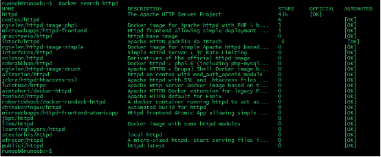

# Docker 镜像使用

当运行容器时，使用的镜像如果在本地中不存在，docker 就会自动从 docker 镜像仓库中下载，默认是从 Docker Hub 公共镜像源下载。

下面我们来学习：

- 1、管理和使用本地 Docker 主机镜像
- 2、创建镜像

------

## 列出镜像列表

我们可以使用 **docker images** 来列出本地主机上的镜像。

```bash
runoob@runoob:~$ docker images           
REPOSITORY          TAG                 IMAGE ID            CREATED             SIZE
hello-world         latest              fce289e99eb9        3 months ago        1.84kB
ubuntu              15.10               9b9cb95443b5        2 years ago         137MB
training/webapp     latest              6fae60ef3446        3 years ago         349MB
```

各个选项说明:

- **REPOSITORY：**表示镜像的仓库源
- **TAG：**镜像的标签
- **IMAGE ID：**镜像ID
- **CREATED：**镜像创建时间
- **SIZE：**镜像大小

同一仓库源可以有多个 TAG，代表这个仓库源的不同个版本，如ubuntu仓库源里，有15.10、14.04等多个不同的版本，我们使用 REPOSITORY:TAG 来定义不同的镜像。

所以，我们如果要使用版本为15.10的ubuntu系统镜像来运行容器时，命令如下：

```
runoob@runoob:~$ docker run -t -i ubuntu:15.10 /bin/bash 
root@d77ccb2e5cca:/#
```

如果要使用版本为14.04的ubuntu系统镜像来运行容器时，命令如下：

```
runoob@runoob:~$ docker run -t -i ubuntu:14.04 /bin/bash 
root@39e968165990:/# 
```

如果你不指定一个镜像的版本标签，例如你只使用 ubuntu，docker 将默认使用 ubuntu:latest 镜像。

------

## 获取一个新的镜像

当我们在本地主机上使用一个不存在的镜像时 Docker 就会自动下载这个镜像。如果我们想预先下载这个镜像，我们可以使用 docker pull 命令来下载它。

```
Crunoob@runoob:~$ docker pull ubuntu:13.10
13.10: Pulling from library/ubuntu
6599cadaf950: Pull complete 
23eda618d451: Pull complete 
f0be3084efe9: Pull complete 
52de432f084b: Pull complete 
a3ed95caeb02: Pull complete 
Digest: sha256:15b79a6654811c8d992ebacdfbd5152fcf3d165e374e264076aa435214a947a3
Status: Downloaded newer image for ubuntu:13.10
```

下载完成后，我们可以直接使用这个镜像来运行容器。

------

## 查找镜像

我们可以从 Docker Hub 网站来搜索镜像，Docker Hub 网址为： 

https://hub.docker.com/


我们也可以使用 docker search 命令来搜索镜像。比如我们需要一个httpd的镜像来作为我们的web服务。我们可以通过 docker search 命令搜索 httpd 来寻找适合我们的镜像。

```
runoob@runoob:~$  docker search httpd
```



**NAME:**镜像仓库源的名称

**DESCRIPTION:**镜像的描述

**OFFICIAL:**是否docker官方发布

------

## 拖取镜像

我们决定使用上图中的httpd 官方版本的镜像，使用命令 docker pull 来下载镜像。

```
runoob@runoob:~$ docker pull httpd
Using default tag: latest
latest: Pulling from library/httpd
8b87079b7a06: Pulling fs layer 
a3ed95caeb02: Download complete 
0d62ec9c6a76: Download complete 
a329d50397b9: Download complete 
ea7c1f032b5c: Waiting 
be44112b72c7: Waiting
```

下载完成后，我们就可以使用这个镜像了。

```
runoob@runoob:~$ docker run httpd
```

------

## 创建镜像

当我们从docker镜像仓库中下载的镜像不能满足我们的需求时，我们可以通过以下两种方式对镜像进行更改。

- 1.从已经创建的容器中更新镜像，并且提交这个镜像
- 2.使用 Dockerfile 指令来创建一个新的镜像

------

## 更新镜像

更新镜像之前，我们需要使用镜像来创建一个容器。

```
runoob@runoob:~$ docker run -t -i ubuntu:15.10 /bin/bash
root@e218edb10161:/# 
```

在运行的容器内使用 apt-get update 命令进行更新。

在完成操作之后，输入 exit命令来退出这个容器。

此时ID为e218edb10161的容器，是按我们的需求更改的容器。我们可以通过命令 docker commit来提交容器副本。

```
runoob@runoob:~$ docker commit -m="has update" -a="runoob" e218edb10161 runoob/ubuntu:v2
sha256:70bf1840fd7c0d2d8ef0a42a817eb29f854c1af8f7c59fc03ac7bdee9545aff8
```

各个参数说明：

- **-m:**提交的描述信息
- **-a:**指定镜像作者
- **e218edb10161：**容器ID
- **runoob/ubuntu:v2:**指定要创建的目标镜像名

我们可以使用 **docker images** 命令来查看我们的新镜像 **runoob/ubuntu:v2**：

```
runoob@runoob:~$ docker images
REPOSITORY          TAG                 IMAGE ID            CREATED             SIZE
runoob/ubuntu       v2                  70bf1840fd7c        15 seconds ago      158.5 MB
ubuntu              14.04               90d5884b1ee0        5 days ago          188 MB
php                 5.6                 f40e9e0f10c8        9 days ago          444.8 MB
nginx               latest              6f8d099c3adc        12 days ago         182.7 MB
mysql               5.6                 f2e8d6c772c0        3 weeks ago         324.6 MB
httpd               latest              02ef73cf1bc0        3 weeks ago         194.4 MB
ubuntu              15.10               4e3b13c8a266        4 weeks ago         136.3 MB
hello-world         latest              690ed74de00f        6 months ago        960 B
training/webapp     latest              6fae60ef3446        12 months ago       348.8 MB
```

使用我们的新镜像 **runoob/ubuntu** 来启动一个容器

```
runoob@runoob:~$ docker run -t -i runoob/ubuntu:v2 /bin/bash                            
root@1a9fbdeb5da3:/#
```

------

## 构建镜像

我们使用命令 **docker build** ， 从零开始来创建一个新的镜像。为此，我们需要创建一个 Dockerfile 文件，其中包含一组指令来告诉 Docker 如何构建我们的镜像。

```
runoob@runoob:~$ cat Dockerfile 
FROM    centos:6.7
MAINTAINER      Fisher "fisher@sudops.com"

RUN     /bin/echo 'root:123456' |chpasswd
RUN     useradd runoob
RUN     /bin/echo 'runoob:123456' |chpasswd
RUN     /bin/echo -e "LANG=\"en_US.UTF-8\"" >/etc/default/local
EXPOSE  22
EXPOSE  80
CMD     /usr/sbin/sshd -D
```

每一个指令都会在镜像上创建一个新的层，每一个指令的前缀都必须是大写的。

第一条FROM，指定使用哪个镜像源

RUN 指令告诉docker 在镜像内执行命令，安装了什么。。。

然后，我们使用 Dockerfile 文件，通过 docker build 命令来构建一个镜像。

```
runoob@runoob:~$ docker build -t runoob/centos:6.7 .
Sending build context to Docker daemon 17.92 kB
Step 1 : FROM centos:6.7
 ---&gt; d95b5ca17cc3
Step 2 : MAINTAINER Fisher "fisher@sudops.com"
 ---&gt; Using cache
 ---&gt; 0c92299c6f03
Step 3 : RUN /bin/echo 'root:123456' |chpasswd
 ---&gt; Using cache
 ---&gt; 0397ce2fbd0a
Step 4 : RUN useradd runoob
......
```

参数说明：

- **-t** ：指定要创建的目标镜像名
- **.** ：Dockerfile 文件所在目录，可以指定Dockerfile 的绝对路径

使用docker images 查看创建的镜像已经在列表中存在,镜像ID为860c279d2fec

```
runoob@runoob:~$ docker images 
REPOSITORY          TAG                 IMAGE ID            CREATED              SIZE
runoob/centos       6.7                 860c279d2fec        About a minute ago   190.6 MB
runoob/ubuntu       v2                  70bf1840fd7c        17 hours ago         158.5 MB
ubuntu              14.04               90d5884b1ee0        6 days ago           188 MB
php                 5.6                 f40e9e0f10c8        10 days ago          444.8 MB
nginx               latest              6f8d099c3adc        12 days ago          182.7 MB
mysql               5.6                 f2e8d6c772c0        3 weeks ago          324.6 MB
httpd               latest              02ef73cf1bc0        3 weeks ago          194.4 MB
ubuntu              15.10               4e3b13c8a266        5 weeks ago          136.3 MB
hello-world         latest              690ed74de00f        6 months ago         960 B
centos              6.7                 d95b5ca17cc3        6 months ago         190.6 MB
training/webapp     latest              6fae60ef3446        12 months ago        348.8 MB
```

我们可以使用新的镜像来创建容器

```
runoob@runoob:~$ docker run -t -i runoob/centos:6.7  /bin/bash
[root@41c28d18b5fb /]# id runoob
uid=500(runoob) gid=500(runoob) groups=500(runoob)
```

从上面看到新镜像已经包含我们创建的用户runoob

------

## 设置镜像标签

我们可以使用 docker tag 命令，为镜像添加一个新的标签。

```
runoob@runoob:~$ docker tag 860c279d2fec runoob/centos:dev
```

docker tag 镜像ID，这里是 860c279d2fec ,用户名称、镜像源名(repository name)和新的标签名(tag)。

使用 docker images 命令可以看到，ID为860c279d2fec的镜像多一个标签。

```
runoob@runoob:~$ docker images
REPOSITORY          TAG                 IMAGE ID            CREATED             SIZE
runoob/centos       6.7                 860c279d2fec        5 hours ago         190.6 MB
runoob/centos       dev                 860c279d2fec        5 hours ago         190.6 MB
runoob/ubuntu       v2                  70bf1840fd7c        22 hours ago        158.5 MB
ubuntu              14.04               90d5884b1ee0        6 days ago          188 MB
php                 5.6                 f40e9e0f10c8        10 days ago         444.8 MB
nginx               latest              6f8d099c3adc        13 days ago         182.7 MB
mysql               5.6                 f2e8d6c772c0        3 weeks ago         324.6 MB
httpd               latest              02ef73cf1bc0        3 weeks ago         194.4 MB
ubuntu              15.10               4e3b13c8a266        5 weeks ago         136.3 MB
hello-world         latest              690ed74de00f        6 months ago        960 B
centos              6.7                 d95b5ca17cc3        6 months ago        190.6 MB
training/webapp     latest          
```